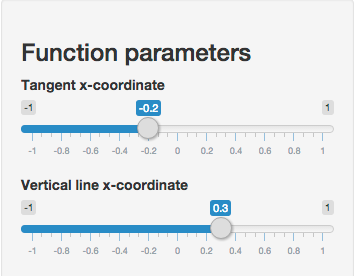
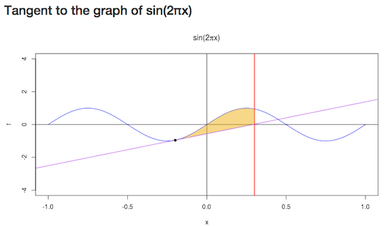

## Motivation

Math concepts are traditionally taught using textbooks. However, using interactive applications can
help to elucidate certain concepts.

Therefore, we present a small and simple reactive web-app to help the student explain tangent lines and
enclosed regions.

The app and source are located below:

- App: https://dmarjenburgh.shinyapps.io/project
- Source: https://github.com/dmarjenburgh/InteractiveCalculus

--- .class #id

## How it works
The simple app has been created using the R package shiny. An image of the controls are on the left and
an image of the plot is on the right




--- .class #id

## Calculation of the area
The area of the shaded region is calculated on the server in R. Below is an excerpt of the piece of code that calculates the area by integration:
```{r, eval = FALSE}
f <- function (x) { sin(2*pi*x) }
tangentf <- function(x, x0, y0) { 2*pi*cos(2*pi*x0)*(x - x0) + y0 }
integrand <- function(x0, y0, xvert) {
    function(x) { abs(f(x) - tangentf(x, x0, y0)) }
}

area <- function(input) {
    xic <- input$xic; yic <- f(xic) # x and y coordinates for the tangent line
    x_vert <- input$vertx
    x_lower <- min(xic, x_vert); x_upper <- max(xic, x_vert)
    integrate(integrand(xic, yic), x_lower, x_upper)$value       
}

```

--- .class #id

## Example
For example, the default input values for the tangent through `(0, 0)` and `x_upper  = 0.5` evaluates to:
```{r}
integrate(integrand(0, 0), 0, 0.5)$value
```


## Thank you very much

I hope you enjoyed the presentation. Please check out the amazing app and tell your friends on twitter.

[Click here to view the app](https://dmarjenburgh.shinyapps.io/project)
